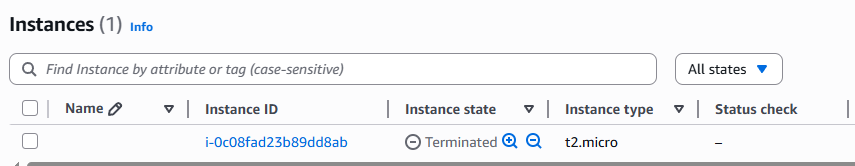

## This is an example of how to run a EC2 Instance on AWS.

This example demonstrates the basic Terraform workflow to start a AWS EC2 Instance using the HashiCorp AWS provider.

It is important to setup a the right AWS Region and confirm to correct AWS AMI ID's since every AMI ID is unique for the region you deploy resources in. You can check out the AMI Catalog for eu-central-1 here:
https://eu-central-1.console.aws.amazon.com/ec2/home?region=eu-central-1#AMICatalog:
terra

To beginn, initialize the project by running `terraform init`.

Expected output:
>
>Initializing the backend...
>Initializing provider plugins...
>- Finding latest version of hashicorp/aws...
>Terraform has created a lock file .terraform.lock.hcl to record the provider
>selections it made above. Include this file in your version control repository
>so that Terraform can guarantee to make the same selections by default when
>you run "terraform init" in the future.
>
>Terraform has been successfully initialized!
>

This confirms that Terraform is properly initialized and has downloaded all required providers.

Next, create a plan to preview the infrastructure changes with: `terraform plan -out exampleplan`.

Expected output (shortend):
>Terraform will perform the following actions:
>
> # aws_instance.test_server will be created
>  + resource "aws_instance" "test_server" {
>      + ami                                  = "ami-015f3aa67b494b27e"
>      + arn                                  = (known after apply)
>      + associate_public_ip_address          = (known after apply)
>      + availability_zone                    = (known after apply)
>      + instance_type                        = "t2.micro"
>      + region                               = "eu-central-1"
>

To actually apply the configuration execute `terraform apply testplan`.

Expected output:
> aws_instance.test_server: Creating...
> aws_instance.test_server: Still creating... [00m10s elapsed]
> aws_instance.test_server: Still creating... [00m20s elapsed]
> aws_instance.test_server: Still creating... [00m30s elapsed]
> aws_instance.test_server: Creation complete after 32s [id=i-0c08fad23b89dd8ab]

Apply complete! Resources: 1 added, 0 changed, 0 destroyed.

If you modify any configuration values, you can rerun the plan and apply commands. Terraform will show a detailed preview of the changes before applying them.

You can check the result in the AWS Dashboard:

Finally, you can verify what will be destroyed with: `terraform plan -destroy` And remove the environment entirely using: `terraform destroy`.

Expected Output (shortend):
>
>Terraform will perform the following actions:
>
>  # aws_instance.test_server will be destroyed
>  - resource "aws_instance" "test_server" {
>      - ami                                  = "ami-015f3aa67b494b27e" -> null
>      - arn                                  = "arn:aws:ec2:eu-central-1:134071079482:instance/i-0c08fad23b89dd8ab" -> null
>      - associate_public_ip_address          = true -> null
>      - availability_zone                    = "eu-central-1a" -> null
>Plan: 0 to add, 0 to change, 1 to destroy.
>
>Do you really want to destroy all resources?
>  Terraform will destroy all your managed infrastructure, as shown above.
>  There is no undo. Only 'yes' will be accepted to confirm.
>
>
>Enter a value: yes
>
>aws_instance.test_server: Destroying... [id=i-0c08fad23b89dd8ab]
>aws_instance.test_server: Still destroying... [id=i-0c08fad23b89dd8ab, 00m10s elapsed]
>aws_instance.test_server: Still destroying... [id=i-0c08fad23b89dd8ab, 00m20s elapsed]
>aws_instance.test_server: Still destroying... [id=i-0c08fad23b89dd8ab, 00m30s elapsed]
>aws_instance.test_server: Destruction complete after 30s
>
>Destroy complete! Resources: 1 destroyed.
>

Confirmation in EC2 Dashboard:
