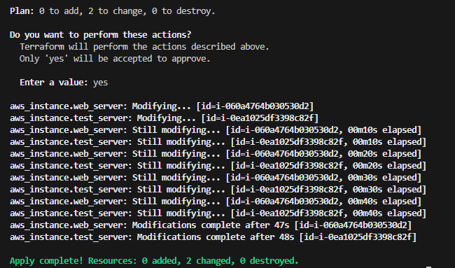

# Deploying Multiple EC2 Instances and Managing Desired State with Terraform

This example demonstrates how to use Terraform to launch multiple AWS EC2 instances and modify their desired state.
Additionally, authentication has been migrated from environment variables to AWS named profiles for improved security and flexibility.

---

## Overview

This configuration extends a basic single-instance Terraform setup to illustrate how to:
- Deploy multiple EC2 instances efficiently.
- Scale infrastructure while maintaining clear resource organization.
- Manage state changes, such as modifying the instance type.
- Use AWS CLI profiles for authentication instead of environment variables.

### Key Highlights
- Updated EC2 instance type in Terraform configuration from t2.micro → t2.small to demonstrate state change and resource recreation.
- Replaced environment variable–based authentication with AWS CLI profiles for better credential management.

---
## Implementing AWS Profiles

Terraform can authenticate with AWS via CLI profiles, which store credentials securely in the AWS configuration files.

Option 1: Configure via AWS CLI

Run the following command: `aws configure --profile terraform`

You will be prompted to enter:
- AWS Access Key ID
- AWS Secret Access Key
- Default region name (e.g. eu-central-1)
- Default output format (e.g. json)

This automatically creates the necessary configuration files in your home directory.

Option 2: Configure Manually

Credentials file:

Windows: %USERPROFILE%\.aws\credentials
Linux/macOS: ~/.aws/credentials

Example:
```bash
[terraform]
aws_access_key_id = MY IAM Terraform Access Key
aws_secret_access_key = MY IAM Terraform SECRET Access Key
```
Config file:

Windows: %USERPROFILE%\.aws\config
Linux/macOS: ~/.aws/config

Example:
```bash
[profile terraform]
region = eu-central-1
output = json
```

In your Terraform AWS provider block, reference the named profile as follows:
```bash
provider "aws" {
  profile = "terraform"
  region  = "eu-central-1"
}
```
This ensures Terraform authenticates using the specified AWS CLI profile rather than relying on environment variables.

## Terraform Workflow

1. **Initialize the working directory**

2. **Review the planned infrastructure**

3. **Deploy the configuration**

4. **Verify deployment**

Confirm that both instances are deployed and tagged correctly

5. **Changing the instance_type**

Open Main.tf with the editor of your choice 
Change the instance_type = "t2.micro" to instance_type = "t2.small"

6. **Apply new plan**

Execute terraform plan and notice the expected output:

>Terraform used the selected providers to generate the following execution plan. Resource actions are indicated with the following        
>symbols:
>  ~ update in-place
>
>Terraform will perform the following actions:
>
>  # aws_instance.test_server will be updated in-place
>  ~ resource "aws_instance" "test_server" {
>        id                                   = "i-0ea1025df3398c82f"
>      ~ instance_type                        = "t2.micro" -> "t2.small"
>  ...
>
>Plan: 0 to add, 2 to change, 0 to destroy.
>

As you can see terraform is planning to do an update in-place.
If you want to confirm go on and execute `terraform apply`

7. **Verify deployment**

Confirm that both instances are deployed and are scaled up correctly

8. **Clean up resources**

    ```bash
    terraform destroy
    ```
Destroys all resources created by this configuration to avoid ongoing costs.

9. **Proof of Concept**
The screenshots below confirm successful deployment of two EC2 instances before and after the changing the desired state:

