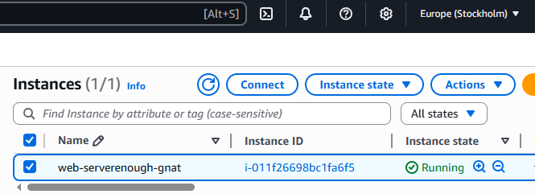

# Deploying Multiple EC2 Instances Across Regions with Terraform

This example demonstrates how to use Terraform to deploy multiple AWS EC2 instances across different regions and manage their desired state.
It also showcases how to authenticate using AWS CLI profiles and how to use random ID generators to create unique resource names.

---

## Overview

This configuration extends a basic single-instance Terraform setup to illustrate how to:
- Deploy multiple EC2 instances in different AWS regions.
- Implement unique naming conventions using random generators.
 -Modify the desired state of existing resources (e.g. instance type changes).
- Use AWS CLI profiles for authentication instead of environment variables.

### Key Highlights
- Demonstrates a multi-provider configuration for Frankfurt and Stockholm.
- Uses the random_pet resource to ensure unique instance names.
- Updates the EC2 instance type to demonstrate Terraform’s in-place updates.
- Replaces environment variable authentication with AWS named profiles for improved security and maintainability.

---

## Terraform Workflow

1. **Initialize the working directory**

2. **Review the planned infrastructure**

3. **Deploy the configuration**

4. **Verify deployment**

Check the AWS Management Console to confirm that both instances are running in:
- eu-central-1 (Frankfurt)
- eu-north-1 (Stockholm)
- unique names are attached

5. **Clean up resources**

Destroys all resources created by this configuration to avoid ongoing costs.

9. **Proof of Concept**
The screenshots below confirm the successful deployment and modification of two EC2 instances across regions:

