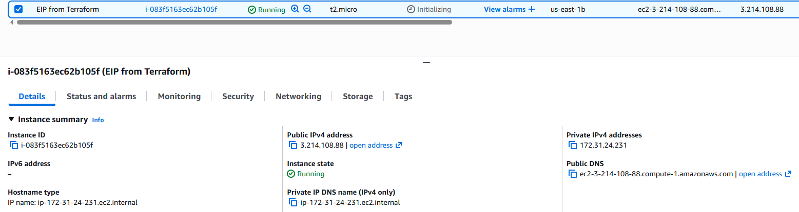

# Elastic IP + EC2 Instance on AWS with Terraform

This example demonstrates how to provision an **EC2 instance** and associate an **Elastic IP (EIP)** to it using Terraform.

---

## Overview

This configuration demonstrates how to:
- Deploy a basic **EC2 instance** in AWS.
- Allocate an **Elastic IP** inside a VPC (`domain = "vpc"`).
- Associate the Elastic IP directly to the EC2 instance via the `instance` argument.

### Key Highlights
- Creates: **1 EC2 instance + 1 Elastic IP**
- Elastic IP is **static public IPv4**
- Association happens automatically during `terraform apply`

---

## Terraform Workflow

1. **Initialize the working directory**

2. **Review the planned infrastructure**

3. **Deploy the configuration**

4. **Verify deployment**

In the AWS Console (Region us-east-1):

- EC2 instance is running
- An Elastic IP exists and is associated with the instance
- The instance shows the Elastic IP as its public IPv4

5. **Clean up resources**

Destroys all resources created by this configuration to avoid ongoing costs.

9. **Proof of Concept**
The screenshots below confirm the successful deployment.

