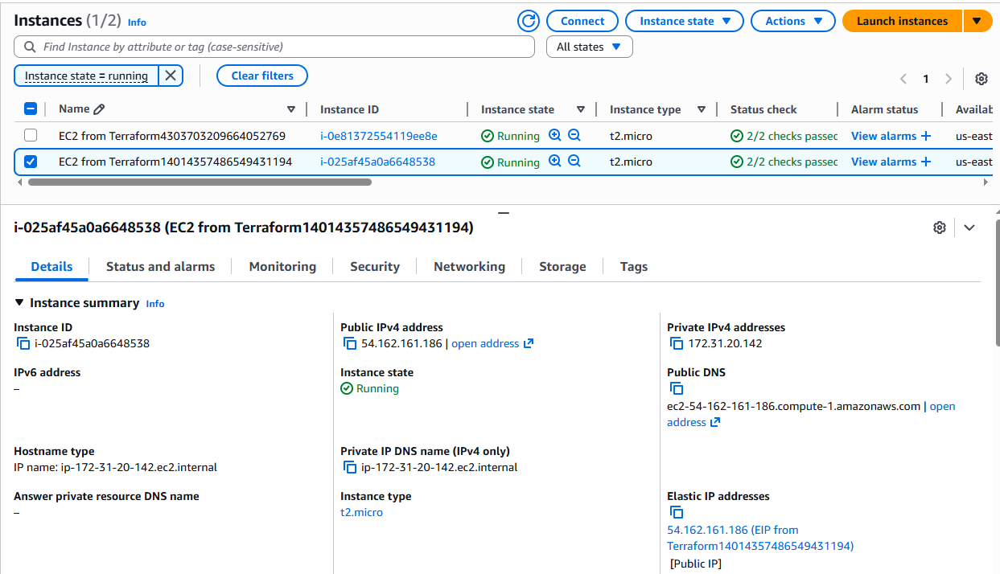

# Dynamic EC2 + Elastic IP Allocation + Separate Association (2× EIP ↔ 2× EC2) with Terraform

This example demonstrates how to deploy two EC2 instances, allocate two Elastic IPs (EIPs), and then associate each EIP to its matching instance using a dedicated association resource (aws_eip_association).

It also uses the Random Provider to generate unique IDs that are appended to resource tags, making it easy to identify which resources belong together.

---

## Overview

This configuration demonstrates how to:

- Generate 2 random identifiers using random_id (count = 2, byte_length = 8)
- Create 2 EC2 instances using count
- Allocate 2 Elastic IPs in a VPC (domain = "vpc") without attaching them directly in the EIP resource
- Associate EIP[0] → EC2[0] and EIP[1] → EC2[1] using aws_eip_association
- Output:
  - The public Elastic IPs (elastic_ips)
  - The instance IDs (instance_ids)

### Key Highlights
- Creates: 2 EC2 instances + 2 allocated Elastic IPs + 2 associations
- EIPs are static public IPv4 addresses
- Clear separation between allocation and association (more flexible)
- Uses count.index to ensure correct 1:1 mapping between:
  - random_id.random[count.index]
  - aws_instance.test_server[count.index]
  - aws_eip.eip[count.index]
- Outputs values to the Terraform CLI for quick verification

---

## What Changed Compared to the “Single EC2 + Single EIP” Version

Before:
- One EC2 instance
- One EIP
- One association/output (elastic_ip)
- No random IDs
- Resources were static (no iteration)

Now:
- Two EC2 instances and two EIPs are created using count = 2
- Random IDs are generated (one per index) and appended to tags
- Outputs are now lists, not single values:
  - elastic_ips = ["x.x.x.x", "y.y.y.y"]
  - instance_ids = ["i-...", "i-..."]

**Why Use a Separate aws_eip_association?**

Instead of attaching the EIP inside aws_eip, this setup splits it:
- Allocate the EIP (aws_eip)
- Associate it (aws_eip_association)

Why that matters
- More flexible: Re-associate an existing EIP to another instance later by only changing the association.
- Cleaner lifecycle control: Allocation and attachment are managed separately, which can reduce unexpected replacements.
- More explicit intent: “EIP exists” and “EIP is attached” are treated as two distinct states.

## Terraform Workflow

1. **Initialize the working directory**

2. **Review the planned infrastructure**

3. **Deploy the configuration**

4. **Verify deployment**

In the Terraform CLI:

- Confirm outputs for:
  - elastic_ips (list of public IPs)
  - instance_ids (list of EC2 instance IDs)

In the AWS Console (Region us-east-1):
- 2 EC2 instances are running
- 2 Elastic IPs exist (Allocated)
- Each Elastic IP is associated to a different instance
- Tags include the random ID suffix, making mapping easier

9. **Proof of Concept**
The screenshots below confirm the successful deployment.

