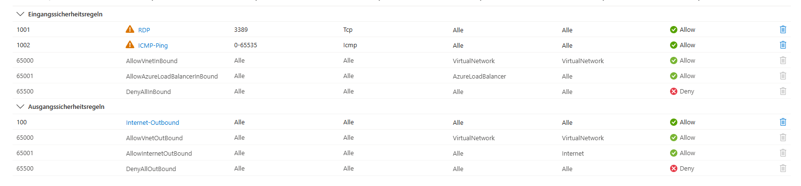

# Deploying Multi-Region Hub-Spoke: 4x Windows Core VMs + VNet Peering + NSGs with Terraform
Enterprise hub-spoke topology across France (hub ↔ Switzerland/Spain spokes). Deploys 4 Windows Server 2022 Core VMs (1 per subnet), bidirectional VNet peering, NSGs (RDP+Ping), static Public IPs. Modular .tf files for production use.

## Regions & Resources
- France (hub): 2 subnets → 2 VMs → 192.168.0.0/16 + 10.0.0.0/16
- Switzerland (spoke): 1 subnet → 1 VM → 172.16.0.0/16
- Spain (spoke): 1 subnet → 1 VM → 10.20.0.0/16
​
---

## Key Features
- Hub-Spoke Peering: FR↔CH/SP (gateway transit on hub)
- 4x VMs: Windows Core 2022 (D2s_v3), RDP via static Public IPs
- NSGs: RDP(3389)+ICMP inbound, full outbound
- Dynamic: Single var drives RGs/VNets/Subnets/VMs via flatten/for_each
- Unique Names: random_id.hex suffixes (global uniqueness)
- Outputs: VM IPs, peering IDs, resource maps

---
​
## Modular Structure (10+ files)
- provider.tf: azurerm/random/local/tls
- variables.tf: Multi-region config (CH/FR/SP subnets)
- main.tf: RGs → VNets → Subnets → Public IPs
- networking.tf: Hub-spoke peering + NSGs
- compute.tf: 4x NICs → 4x Windows VMs
- random.tf: IDs + passwords
- outputs.tf: VM IPs/names/peering status
- locals.tf: subnets_map flattening

---

## Deployment Flow
<code>
var.resource_groups (3 regions)
↓ flatten() → subnets_map (4 entries)
↓ for_each:
RGs(3) → VNets(3) → Subnets(4) → IPs(4) → NICs(4) → VMs(4)
↓ Parallel:
NSGs(4) + Hub↔Spoke peering(8 directions)

</code>
​
​## Terraform Workflow

1. **Initialize the working directory**

2. **Review the planned infrastructure**

3. **Deploy the configuration**

4. **Verify deployment**
​
5. **In the Azure Dashboard:**

<code>
Resource Groups: 
prod-ch/prod-fr/prod-sp
├── VNets: terraform-vpc-prod-*
├── Peerings: peer-hub-fr-to-ch → Connected ✓
├── VMs: terraform-WinCore-fr-subnet-france-1-ABCD → Running ✓
├── Public IPs: tf-public-ip-fr-subnet-france-1 → Static IP ✓
└── NSGs: nsg-subnet-france-1 → RDP:3389 allowed ✓

Validation Check:
Peerings: Azure Portal → VNets → Peerings → Connected ✓
RDP: All 4 Public IPs connect ✓
Ping: ICMP across regions (hub-spoke routing) ✓
</code>

Proof of Concept

