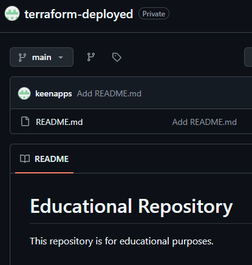

### GitHub Repository Deployment

This module demonstrates how to create a GitHub repository using the Terraform GitHub provider.

It provisions a new private repository in the specified GitHub account and initializes it with a default README (auto_init = true).
Additionally, it creates/updates a custom README.md via github_repository_file.

## Prerequisites

Terraform v1.0+
- A GitHub Personal Access Token (PAT)

### Terraform Workflow

1. **Initialize the working directory**

2. **Review the planned infrastructure**

3. **Deploy the configuration**

4. **Verify deployment**

In the GitHub Dashboard:

- A new repository named `terraform-deployed` exists.
- The custom README.md is added

5. **Clean up resources**

Destroys all resources created by this configuration

9. **Proof of Concept**
The screenshots below confirm the successful deployment.

