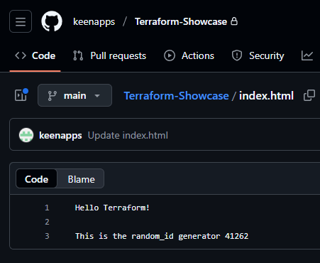

### GitHub Repository Deployment with Local Backend and Random ID Generator

This Terraform configuration demonstrates how to automate the creation of a GitHub repository using the Terraform GitHub provider while managing state locally and introducing a random ID generator for dynamic file content.

The module provisions a new private GitHub repository, initializes it with a default commit, and adds custom files (e.g., README.md and index.html).
The index.html file includes a randomly generated ID for demonstration purposes.

## Prerequisites

Terraform v1.0+
- A GitHub Personal Access Token (PAT)

## Project Structure

<code>
.
├── backend/        # Local state storage
├── backend.tf      # Backend configuration (local)
├── provider.tf     # Provider setup (GitHub + Random)
├── main.tf         # Resource definitions
└── README.md       # Project documentation
</code>

### Key Features

- Local Backend:
The Terraform state is stored locally in ./backend/terraform.tfstate for simplicity and transparency.
This is useful for testing or small-scale proof-of-concept deployments.

- Random ID Generator:
A random_id resource creates a 2-byte random identifier that is dynamically inserted into the index.html file for uniqueness in each deployment.

- Automated GitHub Repository Setup:
Terraform creates a new private repository, initializes it, and uploads both a README.md and an index.html.

### Terraform Workflow

1. **Initialize the working directory**

2. **Review the planned infrastructure**

3. **Deploy the configuration**

4. **Verify deployment**

In your GitHub account:

- A new private repository named Terraform-Showcase appears.
- The repository contains:
 - README.md → contains static text for educational purposes
 - index.html → contains a dynamic message with the generated random ID

5. **Clean up resources**

Destroys all resources created by this configuration

6. **Proof of Concept**
The screenshot below shows the repository successfully created with Terraform and the generated files:

7. **Notes**

- This setup is designed for learning and demonstration purposes.
- For production or team environments, consider:
  - Using a remote backend (e.g., GitHub, S3, or Terraform Cloud)
  - Implementing variable management for repository names and tokens
  - Adding outputs to display relevant metadata after deployment