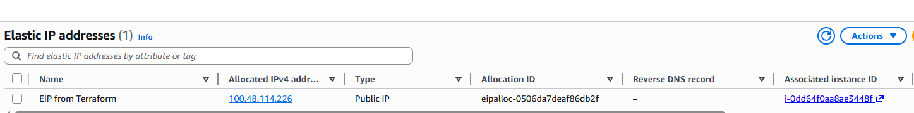
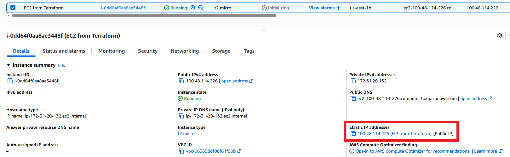

# Elastic IP Allocation + Separate Association (EIP ↔ EC2) with Terraform

This example demonstrates how to deploy an **EC2 instance**, **allocate** an **Elastic IP (EIP)**, and then **associate** the EIP to the instance using a **dedicated association resource**.

---

## Overview

This configuration demonstrates how to:
- Create an **EC2 instance**
- Allocate an **Elastic IP** in a VPC (`domain = "vpc"`) **without** directly attaching it in the same resource block.
- Attach the EIP to the instance using **`aws_eip_association`**.

### Key Highlights
- Creates: **1 EC2 instance + 1 allocated Elastic IP + 1 association**
- EIP is a **static public IPv4** address
- Clear separation between **allocation** and **association** (more flexible)
- Outputs the allocated Elastic IP to the Terraform CLI (via output)

---

## Difference vs. “EIP directly attached in aws_eip”

In the previous version, the EIP was attached like this:

```hcl
resource "aws_eip" "eip1" {
  instance = aws_instance.test_server.id
  domain   = "vpc"
}
```

In this version, it’s split into two steps:

- Allocate the EIP (aws_eip)
- Associate it (aws_eip_association)

**Why that matters**

More flexible: You can later associate the same EIP to a different instance (or even a network interface) by changing only the association.

Cleaner lifecycle control: Allocation and attachment are managed separately, which can reduce “replace” surprises in more complex setups.

More explicit intent: The code makes it obvious that “EIP exists” and “EIP is attached” are two distinct states.

## Terraform Workflow

1. **Initialize the working directory**

2. **Review the planned infrastructure**

3. **Deploy the configuration**

4. **Verify deployment**

In the Terraform CLI

- Confirm the output of elasic_ip = eg. "123.123.123.123"

In the AWS Console (Region us-east-1):

- EC2 instance is running
- Elastic IP exists (Allocated)
- Elastic IP is associated to the instance (Association shown)

9. **Proof of Concept**
The screenshots below confirm the successful deployment.



