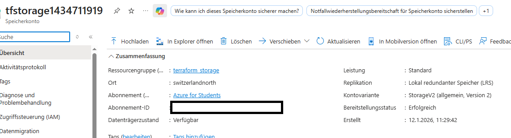

# Deploying Multi-Tiered Infrastructure: 2x Linux VMs + Blob Storage with Terraform
This example demonstrates deployment of two Azure Linux VMs (with Public IPs, SSH auth) in one RG alongside separate Blob Storage (Hot tier demo, unique RG). Uses modular .tf files (provider.tf, networking.tf, compute.tf, storage.tf, random.tf, ssh.tf) for enterprise organization.
​
Modular structure separates concerns: networking/compute in terraform_VM RG, persistent storage in terraform_storage RG. Features count=2 for VMs/NICs/PublicIPs, random_id for uniqueness, tls_private_key for secure SSH, inline blob upload.
​
---

## Overview
Configuration creates:
- Networking (networking.tf): VNet (10.0.0.0/16), Subnet (internal), shared by VMs.
​- Compute (compute.tf): 2x Ubuntu 24.04 VMs (Standard_D2s_v3), 2x NICs (dynamic private IP), 2x static Public IPs, SSH-only access.
​- Storage (storage.tf): Dedicated RG + GPv2 account (LRS), private container (terraform-container), demo blob (my-awesome-content.zip).
​- Helpers (random.tf/ssh.tf): Unique names/keys, local private key export (id_rsa).
​- Outputs (outputs.tf): VM IDs/IPs, storage ID/URL, sensitive SSH key.
​
## Key Highlights
- Modular files per Space rules (provider.tf/ssh.tf separate); scalable to teams. [space-instructions]
- count.index mapping: NIC/PublicIP → VM, NIC/PublicIP → VM.
​- Secure SSH: 4096-bit RSA (ssh.tf), disable_password_authentication=true, local_file exports key (chmod 600).
​- Cross-RG storage: VMs access blob via URL (endpoint + SAS/managed identity)—no direct attach.
​- Outputs actionable: SSH directly (ssh adminuser@<vm_public_ips[0]), blob URL ready for AzCopy.
​​
## What Changed Compared to the last Version
Previous (VM-only):
- Single VM/NIC/PublicIP, main.tf monolith, no storage/RGs.

Now (Production-like):
- 2x everything via count=2, 8 modular files, 2 RGs (compute vs storage persistence).
​- Blob demo: Inline content upload, private container, unique storage name (tfstorage1XXXX).
​- SSH automation: Generated keys auto-injected, private key saved locally.

random_id Usage:
- random.tf: count=2 → VM1/VM2 suffixes + storage pick [0]. Ensures global uniqueness.
​
Storage Integration:
- Separate lifecycle (delete VMs ≠ data loss), accessed via primary_blob_endpoint + SAS.
​
​## Terraform Workflow

1. **Initialize the working directory**

2. **Review the planned infrastructure**

3. **Deploy the configuration**

4. **Verify deployment**
​
5. **In the Azure Dashboard (Region eg. switzerlandnorth):**

- terraform_VM RG: 2x VMs running, NICs/PublicIPs attached, VNet/subnet.
- terraform_storage RG: Storage account → Containers → terraform-container/my-awesome-content.zip.
- VM overview: Public IPv4 from NIC config.

Proof of Concept
2 VMs + storage deployed. VM screenshot example:
Storage blob verified:

