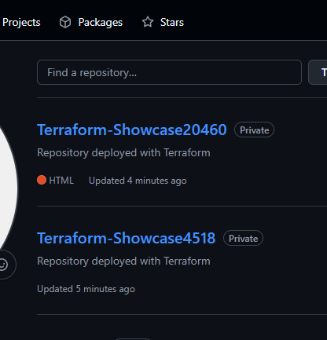
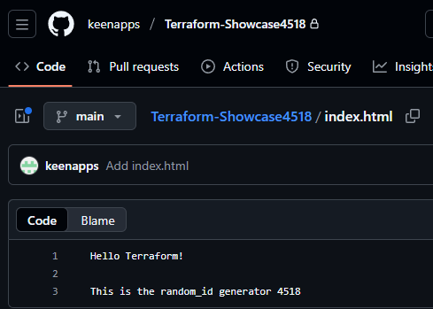

### GitHub Repository Deployment with Local Backend and Random ID Generator

This Terraform configuration demonstrates how to automate the creation of multiple GitHub repositories using the Terraform GitHub provider while managing state locally and introducing a random ID generator to ensure unique naming and content.

The configuration provisions two private GitHub repositories, initializes each with a default commit, and adds custom files (e.g., README.md and index.html) to each repository.
Each repository name and the index.html content include an attached random ID, making every deployed repo unique.

## Prerequisites

Terraform v1.0+
- A GitHub Personal Access Token (PAT)

## Project Structure

<code>
.
├── backend/        # Local state storage
├── backend.tf      # Backend configuration (local)
├── provider.tf     # Provider setup (GitHub + Random)
├── main.tf         # Resource definitions
└── README.md       # Project documentation
</code>

### Key Features

- Local Backend:
  The Terraform state is stored locally in ./backend/terraform.tfstate for simplicity and transparency.
  This is useful for testing or small-scale proof-of-concept deployments.

- Random ID Generator:
  A random_id resource is used together with count.index to generate unique suffixes.
  These suffixes are attached to:
  - Repository names (to avoid naming collisions)
  - File contents (to visually confirm that each repo got the correct ID)

- Automated Multi-Repository Setup (Count + Index):
  Terraform creates two private repositories, initializes them, and uploads:
  - README.md → contains static educational text
  - index.html → contains a dynamic message including the matching random ID
- Unique Excel Entries:
  If you also export or generate Excel-based outputs from the workflow, the random ID ensures entries remain unique per repository deployment (no collisions across repos).

### Terraform Workflow

1. **Initialize the working directory**

2. **Review the planned infrastructure**

3. **Deploy the configuration**

4. **Verify deployment**

In your GitHub account:

- Two new private repositories appear, named like:
  - Terraform-Showcase<random_id_0>
  - Terraform-Showcase<random_id_1>

- Each repository contains:
  - README.md → contains static text for educational purposes
  - index.html → contains a dynamic message with the generated random ID for that specific repo

5. **Clean up resources**

Destroys all resources created by this configuration

6. **Proof of Concept**
The screenshot below shows the repository successfully created with Terraform and the generated files:

7. **Notes**

- This setup is designed for learning and demonstration purposes.
- For production or team environments, consider:
  - Using a remote backend (e.g., GitHub, S3, or Terraform Cloud)
  - Implementing variable management for repository names and tokens
  - Adding outputs to display repository names and generated IDs after deployment