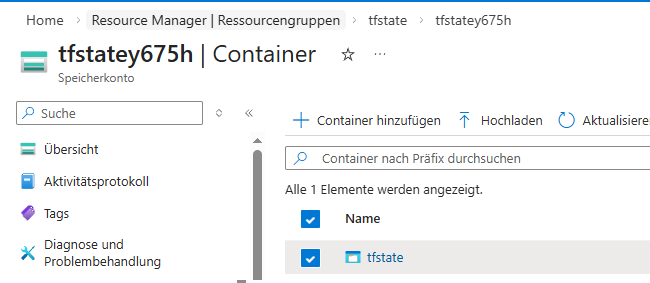
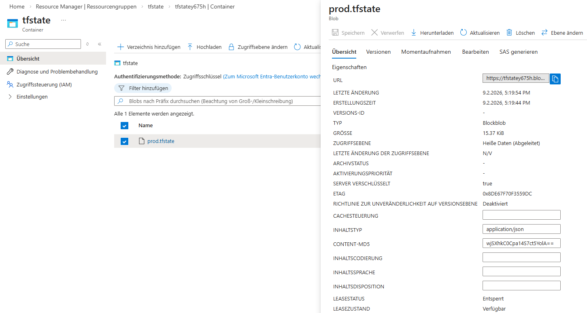

# Deploying Secure Azure Terraform Remote State Backend

Production-ready bootstrap of a secure Azure Storage Account for Terraform Remote State, featuring network-restricted access, encryption at rest, and modular IaC. Deploys Resource Group, Storage Account (LRS), and Blob Container with strict security policies.

# Region & Resources
- Switzerland North (chs): Resource Group → Storage Account (Standard LRS) → Blob Container
- Security: Storage Firewall enabled (Deny default), Allow-List for Deployer IP only
- Encryption: Azure Storage Encryption at Rest (Standard)
- Access: Private Blob Container (No anonymous access)

# Key Features
- Secure State Storage: Blob Container locked down via Storage Firewall (IP Whitelisting)
- Zero-Trust Networking: Default Action Deny on Storage Account + dynamic IP retrieval
- Bootstrap Pattern: Resolves the "Chicken & Egg" problem of creating the backend before using it
- Modular Design: Reuses core modules (azure-rg, azure-storage-account-v2) + custom logic
- Cost-Optimized: ~0.02€/month (Standard LRS Storage), free egress within zone
- Outputs: Storage Account Name, Container Name, Access Key (Sensitive)

# Security & Corporate Network Constraints (Important!)

⚠️ Networking Note for Enterprise Environments

This demo uses data "http" "my_ip" to dynamically fetch the public IP of the execution runner for the Storage Firewall allow-list.

Limitations in Corporate Networks:

Proxies/Zscaler: If you are behind a strict corporate proxy, data "http" might fail or return a generic gateway IP shared by thousands of users ("Over-privileged Access!").

VPN/ExpressRoute: Azure might see a different source IP (Private IP via ExpressRoute) than the one reported by public echo services.

Production Best Practice:
Instead of dynamic IP whitelisting, use Private Endpoints (disable Public Access entirely) and run Terraform agents within a restricted VNet or via Self-Hosted Runners with Managed Identity authentication.

# Modular Structure (main.tf only)

<code>
locals.tf: location="Switzerland North", tags
├── data "http" "my_ip" → Dynamically fetches current public IP
├── modules/azure-rg → Resource Group (state-rg)
├── azurerm_storage_account → Storage Account (LRS, Firewall Rules)
│   └── network_rules → Deny All + Allow data.http.my_ip
└── azurerm_storage_container → Private Blob Container (tfstate)
</code>

# Deployment

### Phase 1: Bootstrap Backend Infrastructure
```bash
terraform init
terraform apply
# Outputs: storage_account_name, container_name, access_key
```

# Migration

After terraform apply, your state is still local (terraform.tfstate). To migrate it to the newly created secure backend:

### Phase 2: Migrate to Remote State
Copy outputs from Phase 1

```bash
terraform output storage_account_name # Copy this!
terraform output container_name
terraform output -raw primary_access_key # Copy this!
```

Update backend.tf with your values:
```bash
terraform {
  backend "azurerm" {
    resource_group_name  = "rg-tfstate-demo"
    storage_account_name = "<from output>"
    container_name       = "tfstate"
    key                  = "demo.tfstate"
  }
}
```
## Set access key:

```bash
export ARM_ACCESS_KEY=$(terraform output -raw primary_access_key)
```
or if you copy the Access Key
```bash
export ARM_ACCESS_KEY="<COPIED_KEY>"
```

## Migrate:

```bash
terraform init -migrate-state
```
Type yes when prompted.

## Production Considerations

- CI/CD: Use Azure AD Workload Identity (OIDC) instead of access keys
- State Locking: Enabled automatically via Azure Blob Storage
- Encryption: At-rest encryption enabled by default
- Network: Consider VNet Service Endpoints for private access

# Verify in Azure Portal

<code>
Resource Group: rg-tfstate-demo
├── Storage Account: tfstateXXXXX (Standard LRS)
│   ├── Networking: Firewalled (Client IP Allowed)
│   └── Containers: tfstate (Private)
│       └── Blob: demo.tfstate (Lease State: Available)

</code>

# Proof of Concept:

The screenshots below confirm the secure backend deployment and successful state migration:


