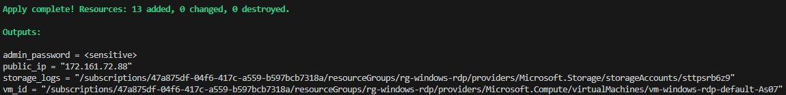
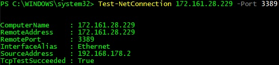
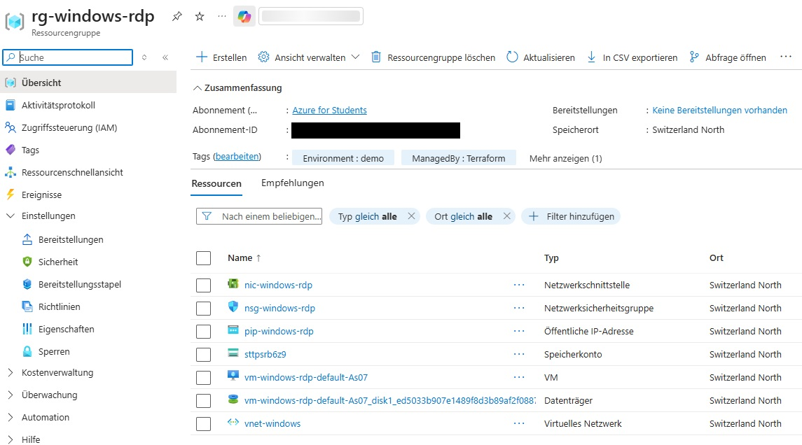
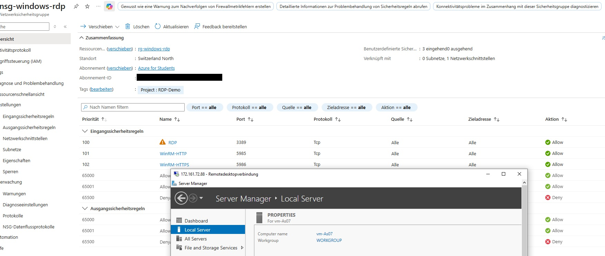

# Deploying Secure RDP Windows VM in Azure Switzerland North with Terraform

Production-ready Terraform deployment of a Windows Server 2022 VM with public RDP access, NSG security, cost-optimized monitoring, and modular IaC. Deploys Resource Group, VNet/Subnet, NSG (RDP+WinRM), Static Public IP, NIC, Storage for diagnostics.

# Region & Resources

- Switzerland North (chs): VNet 10.0.0.0/16 → Subnet 10.0.1.0/24 → Windows VM Standard_D2s_v3
- Security: NSG with RDP(3389), WinRM(5985/5986) inbound from *
- Monitoring: Platform metrics to cheap LRS Storage (no Log Analytics/Grafana)

# Key Features

- Secure RDP Access: Static Public IP + NSG rules (Allow TCP 3389 from anywhere)
- Windows VM: Server 2022 Datacenter Azure Edition, admin SecretSanta + random 20-char password
- Modular Design: 10+ reusable modules (azure-rg, azure-vnet, azure-nsg, azure-subnet, azure-nic, azure-vm-win, random_password)
- Cost-Optimized: ~0.10€/h (D2s_v3 + Storage), free platform metrics
- Outputs: Public IP, password, VM ID, Storage for logs
- Dependencies: Explicit depends_on for NSG → Subnet → NIC → VM

# Modular Structure (main.tf only)

locals.tf: location="Switzerland North", tags
├── modules/azure-rg → Resource Group
├── modules/azure-vnet → VNet 10.0.0.0/16
├── modules/azure-nsg → NSG (RDP+WinRM rules)
├── modules/azure-subnet → Subnet + NSG assoc (nsg_id)
├── azurerm_public_ip → Static Standard PIP
├── modules/azure-nic → NIC (PIP + subnet)
├── azurerm_network_interface_security_group_association → NIC-NSG assoc
├── modules/random_password → 20-char admin PW
├── modules/azure-storage → LRS Storage (logs)
├── modules/azure-vm-win → Windows VM (image + creds)
└── azurerm_monitor_diagnostic_setting → Metrics to Storage

# Deployment Flow

locals → random_suffix
↓ Parallel:
RG → VNet → NSG → Subnet(nsg_id + depends_on) → PIP → NIC → NIC-NSG assoc
↓ Sequential:
PW → Storage → VM(nic_ids) → Diagnostics(VM ID)


1. **Initialize the working directory**

   ```bash
   terraform init
   ```
Downloads the required provider plugins and prepares the backend.

2. **Review the planned infrastructure**

    ```bash
    terraform plan
    ```
Displays all actions Terraform will perform before applying changes.

3. **Deploy the configuration**

    ```bash
    terraform apply
    ```
Launches the instance.

4. **Verify deployment**

# Outputs & Connect

terraform output public_ip      # e.g. 20.123.45.67
terraform output admin_password # Copy to clipboard
mstsc /v:<public_ip>            # Username: .\SecretSanta

# Verify in Azure Portal

Resource Group: rg-windows-rdp
├── VNet: vnet-windows (10.0.0.0/16)
├── Subnet: subnet-windows → NSG assoc ✓
├── NSG: nsg-windows-rdp → RDP 3389 Allow ✓
├── Public IP: pip-windows-rdp → Static ✓
├── NIC: nic-windows-rdp → NSG assoc ✓
├── VM: vm-windows-rdp-default-* → Running ✓
├── Storage: stXXXXXX → insights-metrics-pt1m ✓
└── Diagnostics: AllMetrics to Storage ✓

# Validation:
RDP: Connect via Public IP ✓
Effective NSG: NIC → RDP Allow ✓
Metrics: Portal > VM > Metrics > CPU live ✓

# Proof of Concept:
The screenshots below confirm successful deployment of a Windows VM with RDP Access:






