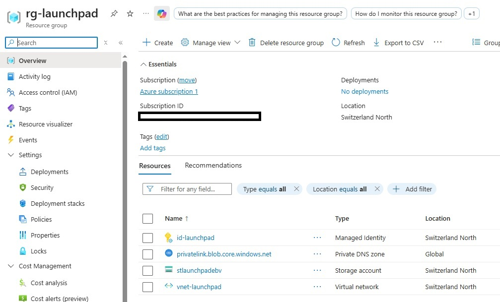
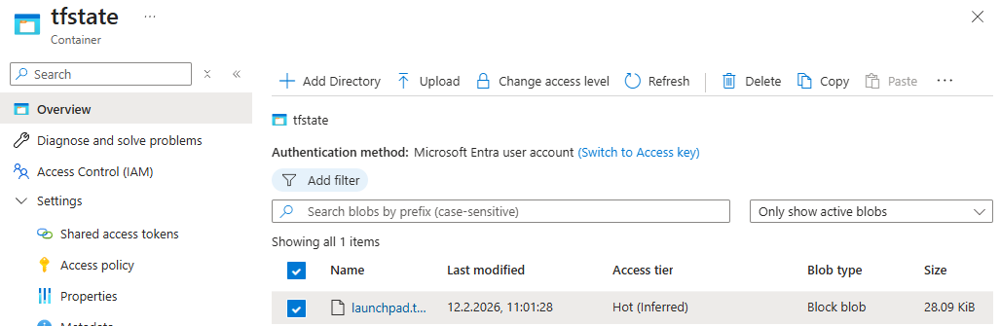
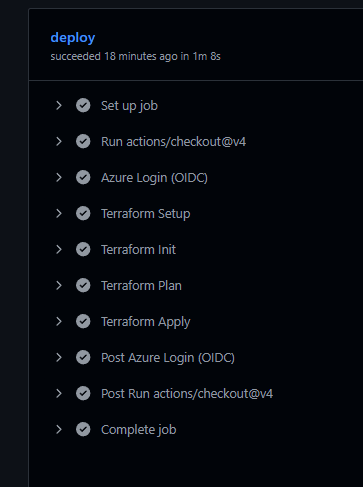

# Secure Azure Terraform Remote State Backend - Work in Progress
OIDC + Azure AD Auth + Data Plane RBAC Deep Dive

Production-grade Terraform remote state backend on Azure using:

- Azure AD authentication (no access keys)
- GitHub Actions OIDC (Workload Identity Federation)
- Explicit Data Plane RBAC separation
- Deterministic bootstrap → migrate → harden flow

Region: Switzerland North (chs)

- **Inspired By**: Cloudeteer's guide on [Secure Terraform with Workload Identity](https://engineering.cloudeteer.de/blog/2025/secure-terraform-deployments-on-azure-with-workload-identity-federation/).

# Architecture Overview

Resources deployed:

- Resource Group
- User Assigned Managed Identity (UAMI)
- Federated Identity Credentials (GitHub OIDC)
- Azure Storage Account (OAuth only, no access keys)
- Private Blob Container (tfstate)

Security decisions:

- shared_access_key_enabled = false
- default_to_oauth_authentication = true
- public_network_access_enabled staged (bootstrap → hardening)

Backend:

- use_azuread_auth = true

RBAC:

- Control Plane: Owner (subscription scope)
- Data Plane: Storage Blob Data Owner (storage scope)


# The Core Problem: Backend Auth ≠ Provider Auth

Terraform has two independent authentication flows:
 1. Provider (azurerm)
 2. Backend (azurerm backend)

Even with:
```bash
use_oidc = true
storage_use_azuread = true
```
The backend still defaulted to key-based auth.

Result: 403 KeyBasedAuthenticationNotPermitted

Root Cause:
use_azuread_auth = true was missing in the backend block.

Fix:
```bash
terraform {
  backend "azurerm" {
    resource_group_name  = "rg-launchpad"
    storage_account_name = "stlaunchpadxxx"
    container_name       = "tfstate"
    key                  = "launchpad.tfstate"

    use_azuread_auth     = true
  }
}
```

# Second Problem: Data Plane RBAC

After enabling Azure AD auth, migration still failed:
AuthorizationPermissionMismatch

Root cause:
Azure separates:

- Control Plane (ARM)
- Data Plane (Blob)

The Owner role only applies to ARM operations.
It does NOT grant Blob data access.

Fix:
Assign: Storage Blob Data Owner

to the executing identity (local user during bootstrap).
After RBAC propagation (~5–30 minutes), terraform init -migrate-state succeeded.

# GitHub OIDC Configuration

GitHub Workflow Requirements:
```bash
permissions:
  id-token: write
  contents: read

- uses: azure/login@v2
  with:
    client-id: ${{ secrets.AZURE_CLIENT_ID }}
    tenant-id: ${{ secrets.AZURE_TENANT_ID }}
    subscription-id: ${{ secrets.AZURE_SUB_ID }}
```
Terraform requires explicit OIDC environment variables:
```bash
env:
  ARM_USE_OIDC: true
  ARM_CLIENT_ID: ${{ secrets.AZURE_CLIENT_ID }}
  ARM_TENANT_ID: ${{ secrets.AZURE_TENANT_ID }}
  ARM_SUBSCRIPTION_ID: ${{ secrets.AZURE_SUB_ID }}
```

If these are missing, Terraform falls back to Azure CLI auth and fails with:
```bash
Authenticating using the Azure CLI is only supported as a User
```

# Bootstrap Strategy (Reproducible)

**Phase 1 – Local Bootstrap**
Requirements:
- Azure CLI login (user context)
- public_network_access_enabled = true (temporary)
- Storage Blob Data Owner assigned to local user

Commands:
```bash
terraform init
terraform apply
```

**Phase 2 – Backend Migration**

Add backend block and run:
```bash
terraform {
  backend "azurerm" {
    resource_group_name  = "rg-launchpad"
    storage_account_name = "stlaunchpadxxx"
    container_name       = "tfstate"
    key                  = "launchpad.tfstate"
    use_azuread_auth     = true
  }
}
```
```bash
terraform init -migrate-state
```
After confirmation, state is stored in Blob.

**Phase 3 – Network Hardening (Planned Extension)**

The primary objective of this project was:
- Understanding Azure AD authentication flows
- Implementing GitHub OIDC with Workload Identity Federation
- Separating Control Plane and Data Plane RBAC
- Designing a secure remote backend without access keys
Private Endpoint-based network isolation was evaluated but intentionally postponed.

Reason:
- The architectural complexity (DNS resolution, runner placement, VNet integration) exceeds the learning objective of this proof of concept.
- The focus was identity-driven security, not network isolation.
- A Private Endpoint + VNet-integrated runner setup is considered a future extension.

Current Security Model:
- Azure AD authentication only
- Access keys disabled
- Data Plane RBAC enforced
- Public network access enabled (for bootstrap & CI simplicity)

Planned Hardening Steps:
- Remove unnecessary Data Plane role assignments
- Restrict network access (Private Endpoint)
- Disable public network access
- Operate exclusively via CI OIDC identity

**Phase 4 - Rollback** 

Reverting Backend to Local State
To migrate state back from remote Azure Blob to local for cleanup/destroy:

Step 1: Comment Backend Block
```bash
# terraform {
#   backend "azurerm" {
#     resource_group_name  = "rg-launchpad"
#     storage_account_name = "stlaunchpad8uf"
#     container_name       = "tfstate"
#     key                  = "launchpad.tfstate"
#   }
# }

```
Step 2: Reconfigure Backend
```bash
terraform init -migrate-state
```
Terraform detects backend change (azurerm → local) and prompts for confirmation. State is now local (terraform.tfstate).

Step 3: Verify
```bash
terraform state list
```
Cleanup & Destroy
```bash
terraform destroy -auto-approve
```
Deletes all resources (RG, UAMI, Storage, VNet, DNS). Requires Azure CLI Owner rights (Control Plane).

Post-Destroy Cleanup (Recommended)
- Delete UAMI id-launchpad (Portal)
- Remove GitHub Environment secrets (AZURE_CLIENT_ID, etc.)
- Clear role assignments (IAM)


# Key Technical Takeaways

- Backend authentication is completely independent from provider authentication.
- Azure separates Control Plane and Data Plane RBAC.
- Owner does not imply Blob access.
- OIDC requires both:
  - Azure Login Action
  - Terraform ARM_* environment variables
- RBAC propagation delays are real and must be accounted for.
- Secure backend design requires staged hardening.

# This project demonstrates:

- Real Azure AD token flow understanding
- Workload Identity Federation with GitHub
- Production-ready remote state without access keys
- Clean bootstrap-to-harden architecture
- Root Cause Analysis driven debugging (including iterative trial-and-error where required)

# Proof of Concept:

The screenshots below confirm the secure backend deployment, successful state migration and github workflow:
Deployed resources (control plane)


State stored in Azure Blob (data plane)


CI pipeline authenticated via OIDC
